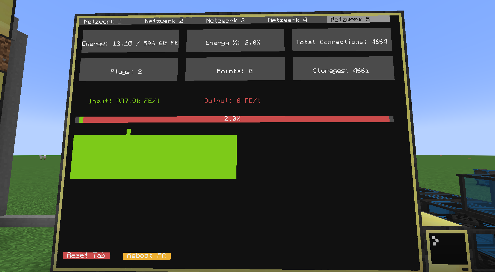
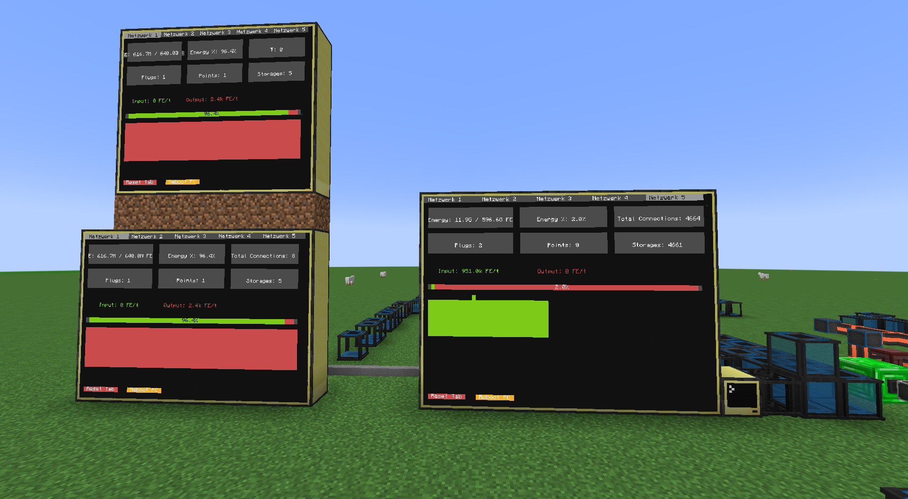
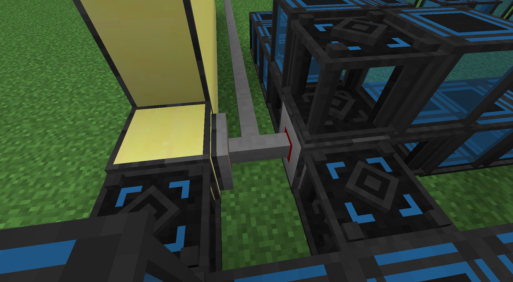
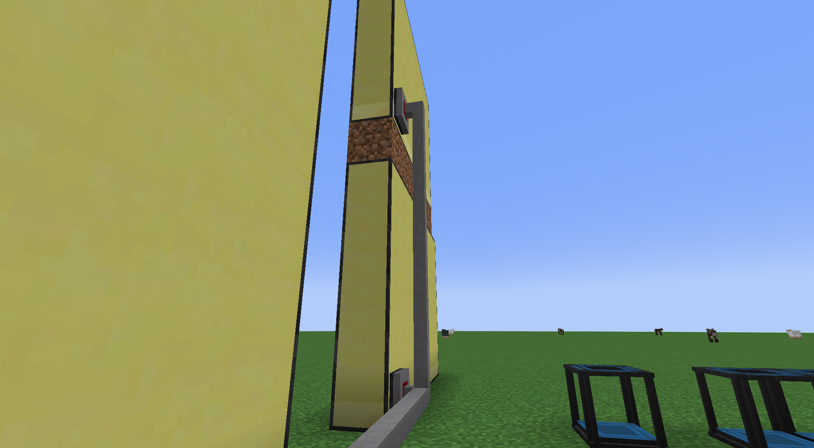

# FluxNet Monitor for CC: Tweaked

This project displays key statistics and energy flow from [Flux Networks x CC: Tweaked](https://www.curseforge.com/minecraft/mc-mods/flux-network-x-cc-tweaked) on one or more Computercraft monitors.

## Features

- Overview of all Flux Controllers in the network
- Tabs for multiple networks/controllers
- Live display of energy, input/output, buffer, connections, points, storages, plugs
- Automatic scaling for small and large monitors
- Touch support: tab switching, reset, reboot
- Logging with rotation (log.json in the `/logs` folder)
- Multiple selectable themes (color schemes)

## Requirements

- [CC: Tweaked](https://modrinth.com/mod/cc-tweaked) (Computercraft for modern Minecraft versions)
- [Flux Networks x CC: Tweaked](https://www.curseforge.com/minecraft/mc-mods/flux-network-x-cc-tweaked)
- A computer (or advanced computer) with a connected monitor
- Optional: Multiple monitors for multi-display

**Note:**  
The program is optimized for monitors with at least 6x5 blocks.  
With this size (or larger), the display looks best and all functions are clearly readable.

## Installation

1. Copy all `.lua` files (`startup.lua`, `log.lua`, `network_ui.lua`, `themes.lua`) into your computer folder (`computercraft/computer/<ID>/`).
2. Set the theme in `startup.lua` (e.g. `local theme = themes.default` or `themes.blue`).
3. Start the computer – the program will run automatically.

## Usage

- **Tab switching:** Tap the tab bar at the top of the monitor.
- **Reset Tab:** Tap "Reset Tab" at the bottom to reset the chart history.
- **Reboot PC:** Tap "Reboot PC" to restart the computer.
- **Multiple monitors:** Each monitor can be operated independently.

## Notes

- The display automatically adapts to the monitor size.
- Large numbers are shown as "1.2k", "3.4M", etc.
- Log files are stored in the `/logs` folder on the computer.

## Support

Questions, bugs or suggestions?  
Create an issue or contact me directly!

## Screenshots

---

**Required Mods:**
- [CC: Tweaked (Modrinth)](https://modrinth.com/mod/cc-tweaked)
- [Flux Networks x CC: Tweaked (CurseForge)](https://www.curseforge.com/minecraft/mc-mods/flux-network-x-cc-tweaked)