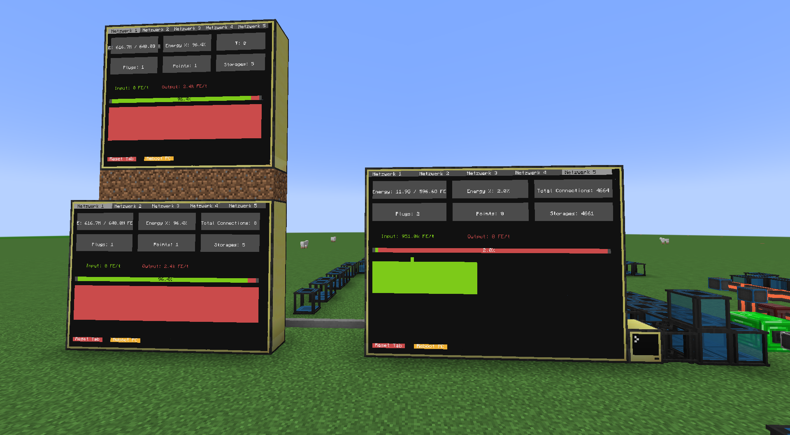

# FluxNet-Monitor für CC: Tweaked

Dieses Projekt zeigt die wichtigsten Statistiken und den Energiefluss von [Flux Networks x CC: Tweaked](https://www.curseforge.com/minecraft/mc-mods/flux-network-x-cc-tweaked) auf einem oder mehreren Computercraft-Monitoren an.

## Features

- Übersicht über alle Flux-Controller im Netzwerk
- Tabs für mehrere Netzwerke/Controller
- Live-Anzeige von Energie, Input/Output, Buffer, Verbindungen, Points, Storages, Plugs
- Automatische Skalierung für kleine und große Monitore
- Touch-Unterstützung: Tab-Wechsel, Reset, Reboot
- Logging mit Rotation (log.json im `/logs`-Ordner)
- Mehrere Themes (Farbschemata) auswählbar

## Voraussetzungen

- [CC: Tweaked](https://modrinth.com/mod/cc-tweaked) (Computercraft für moderne Minecraft-Versionen)
- [Flux Networks x CC: Tweaked](https://www.curseforge.com/minecraft/mc-mods/flux-network-x-cc-tweaked)
- Ein Computer (oder Advanced Computer) mit angeschlossenem Monitor
- Optional: Mehrere Monitore für Multi-Display

**Hinweis:**  
Das Programm ist für Monitore mit mindestens 6x5 Blöcken optimiert.  
Mit dieser Größe (oder größer) sieht die Anzeige am besten aus und alle Funktionen sind gut lesbar.

## Installation

1. Kopiere alle `.lua`-Dateien (`startup.lua`, `log.lua`, `network_ui.lua`, `themes.lua`) in den Computer-Ordner (`computercraft/computer/<ID>/`).
2. Passe das Theme in `startup.lua` an (z. B. `local theme = themes.default` oder `themes.blue`).
3. Starte den Computer – das Programm läuft automatisch.

## Bedienung

- **Tab-Wechsel:** Tippe oben auf die Tab-Leiste des Monitors.
- **Reset Tab:** Tippe auf „Reset Tab“ unten, um die Verlaufsgrafik zurückzusetzen.
- **Reboot PC:** Tippe auf „Reboot PC“, um den Computer neu zu starten.
- **Mehrere Monitore:** Jeder Monitor kann unabhängig bedient werden.

## Hinweise

- Die Anzeige passt sich automatisch an die Monitorgröße an.
- Große Zahlen werden als „1.2k“, „3.4M“ usw. angezeigt.
- Logdateien findest du im `/logs`-Ordner auf dem Computer.

## Support

Fragen, Fehler oder Wünsche?  
Erstelle ein Issue oder kontaktiere mich direkt!

## Screenshots

---

**Mods benötigt:**
- [CC: Tweaked (Modrinth)](https://modrinth.com/mod/cc-tweaked)
- [Flux Networks x CC: Tweaked (CurseForge)](https://www.curseforge.com/minecraft/mc-mods/flux-network-x-cc-tweaked)